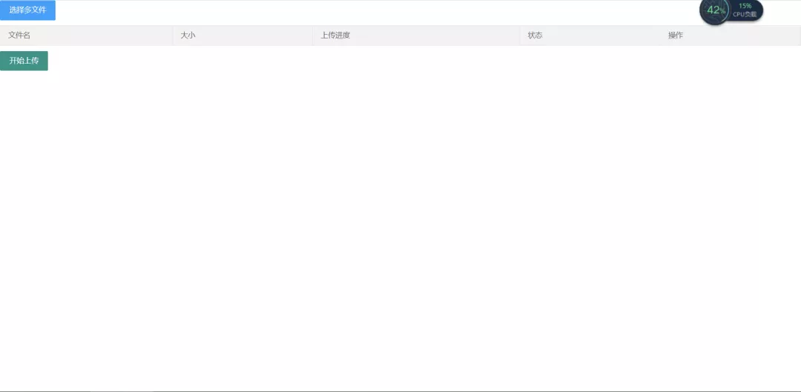
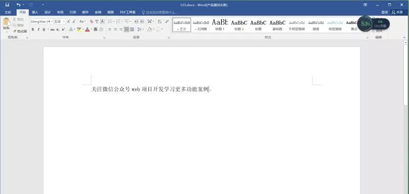
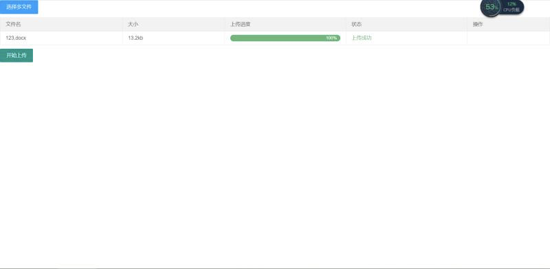
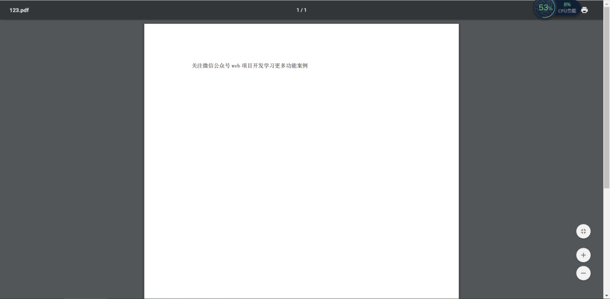

#Springboot+layui前后端分离实现word转pdf功能

效果图
前端页面（上传word文档自动转成pdf文件并且下载到本地）

word文档

上传过程

成功后自动下载

-> https://mp.weixin.qq.com/s?__biz=MzI2NjA1OTMwMg==&mid=2456368128&idx=1&sn=4fb3232ddf50909f137116ba60d5684d&chksm=fd0e7f49ca79f65fa6f49342478e0d37f52d3db206318ffa7a08cf63dd43a7404f1c9565d9fc&scene=178&cur_album_id=1337183186920767488#rd

jacob依赖安装
mvn install:install-file -DgroupId=com.jacob -DartifactId=jacob -Dversion=1.10 -Dpackaging=jar -Dfile=jacob-1.10.jar
